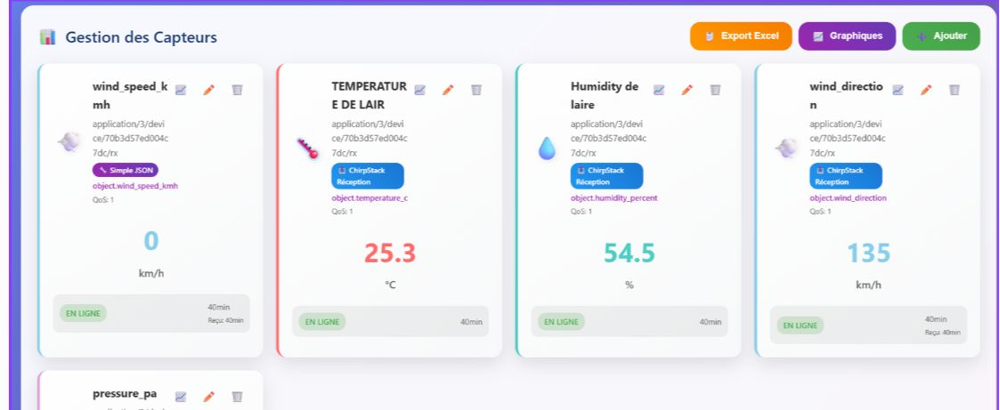
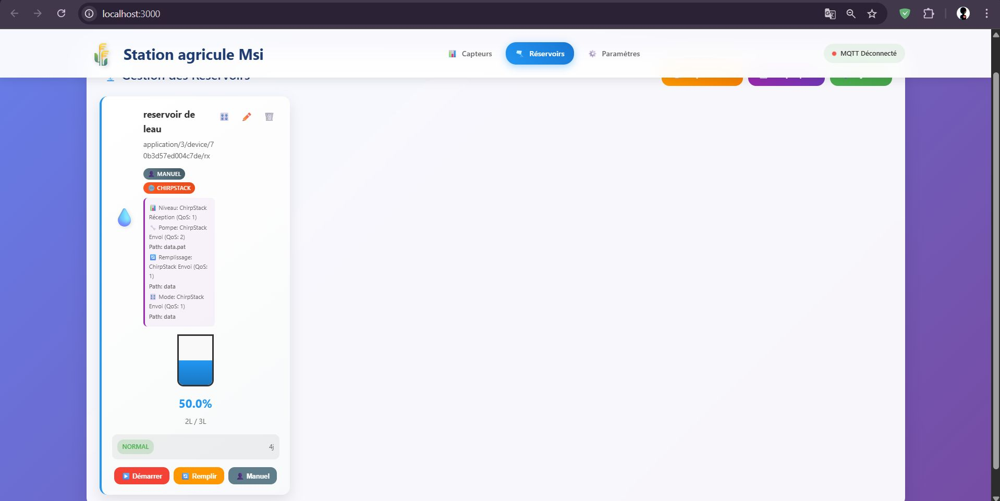
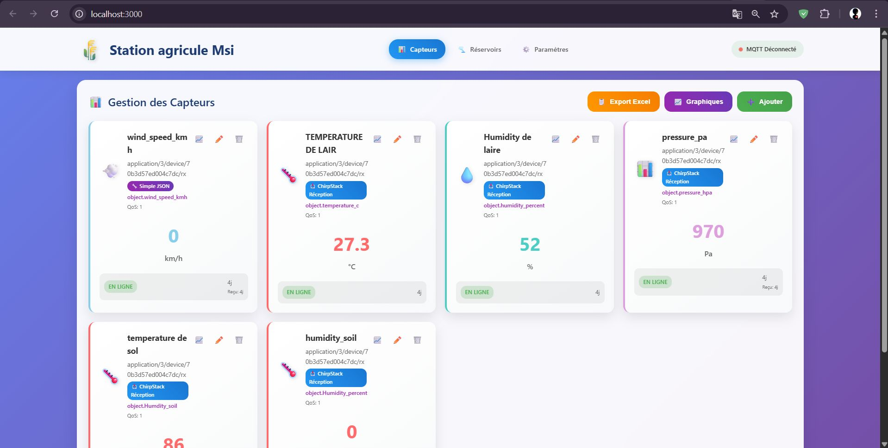
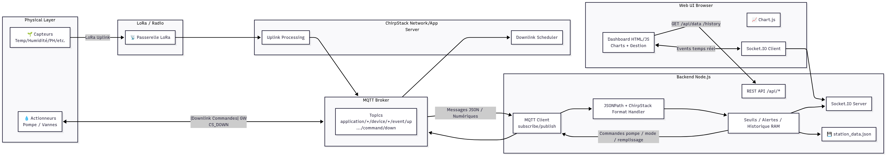

# Station Agricole Pro

Real-time agricultural IoT platform built with Node.js, Express, Socket.IO, MQTT, and ChirpStack integration.

This repository is part of the  project:
`Jumeau Numérique du prototype d’un Système d’Irrigation Intelligent Connecté`.

It provides the software layer used to supervise an intelligent irrigation prototype through a web dashboard, live telemetry, device management, history, alerts, and reservoir control.

## Academic Context

- Full project: `Jumeau Numérique du prototype d’un Système d’Irrigation Intelligent Connecté`
- Module: `Digital Twins`
- Realized by: MOUMAD Abdelghafour
- Supervised by: [BENBRAHIM Mohammed](https://sites.google.com/a/usmba.ac.ma/mbenbrahim/home?authuser=0)

## Project Context

The complete system combines field devices, LoRa/LoRaWAN communication, a gateway, a ChirpStack server, and this real-time supervision platform.

My contribution focused on the end nodes:

- RAK811 LoRa sensor node
- Weather station
- Temperature and humidity sensor node

These sensors communicate with a `RAK2245` LoRaWAN gateway using LoRa. The gateway receives the sensor data and forwards it to a ChirpStack server integrated with the LoRa network. ChirpStack then publishes the data through MQTT, allowing the user interface in this project to receive and display measurements in real time.

## End-to-End Data Flow

1. Sensors collect environmental data in the field.
2. The end nodes transmit the measurements over LoRa.
3. The `RAK2245` gateway receives the uplinks and forwards them to ChirpStack.
4. ChirpStack decodes and publishes the data to MQTT topics.
5. `Station Agricole Pro` subscribes to those MQTT topics.
6. The backend processes the payloads and pushes updates to the dashboard through Socket.IO.

## Main Features

- Real-time sensor monitoring
- ChirpStack uplink integration over MQTT
- Dynamic sensor configuration
- Reservoir level supervision and pump control
- Threshold-based alerts
- Historical data storage in JSON
- Live dashboard updates with Socket.IO
- Support for simple payloads and JSON payload extraction

## Visual Overview





## Architecture



## Technical Overview

| Area | Description |
|------|-------------|
| Backend | Node.js + Express + Socket.IO + MQTT client |
| Frontend | Static HTML/CSS/JavaScript dashboard |
| Messaging | MQTT topics, including ChirpStack payload formats |
| Real-time updates | Socket.IO events from server to clients |
| Persistence | Local JSON file at `./data/station_data.json` |
| Payload parsing | Numeric payloads and JSON extraction with a lightweight JSONPath-style syntax |
| Use case | Agricultural monitoring and intelligent irrigation supervision |

## Supported Integration Model

This project fits the following communication chain:

`Sensor nodes -> LoRa -> RAK2245 gateway -> ChirpStack -> MQTT -> Station Agricole Pro dashboard`

The platform is designed to consume MQTT topics produced by ChirpStack and visualize the measurements in a browser-based interface.

## Installation

### Requirements

- Node.js 16 or later
- npm 7 or later
- MQTT broker
- ChirpStack server and gateway for the full LoRaWAN workflow

### Clone the repository

```bash
git clone https://github.com/Armoumad/Station-Agricole-Pro.git
cd Station-Agricole-Pro
```

### Install dependencies

```bash
npm install
```

### Start the application

```bash
npm start
```

For development with auto-reload:

```bash
npm run dev
```

### Open the dashboard

```text
http://localhost:3000
```

## Configuration

The main runtime configuration is currently defined in `server.js`:

```js
const CONFIG = {
  PORT: 3000,
  MQTT_BROKER: 'mqtt://192.168.230.1:1883',
  DATA_FILE: './data/station_data.json'
};
```

You can adapt the MQTT broker address to match your local gateway, broker, or ChirpStack deployment.

## Example Use Case

An end node can publish measurements such as:

- Air temperature
- Relative humidity
- Weather data
- Reservoir-related telemetry

After the message is forwarded by ChirpStack to MQTT, this platform can:

- Subscribe to the configured topic
- Extract the desired value from the payload
- Store the latest state
- Broadcast the update instantly to connected clients

## API Overview

| Method | Endpoint | Description |
|--------|----------|-------------|
| GET | `/api/data` | Full station snapshot |
| POST | `/api/data` | Bulk update station structure |
| POST | `/api/sensors` | Add a sensor |
| PUT | `/api/sensors/:id` | Update a sensor |
| DELETE | `/api/sensors/:id` | Delete a sensor |
| GET | `/api/sensors/:id/history` | Get sensor history |
| GET | `/api/charts/sensors/compare` | Compare multiple sensors |
| POST | `/api/reservoirs` | Add a reservoir |
| PUT | `/api/reservoirs/:id` | Update a reservoir |
| DELETE | `/api/reservoirs/:id` | Delete a reservoir |
| GET | `/api/reservoirs/:id/history` | Get reservoir history |
| POST | `/api/reservoirs/:id/pump` | Control pump state |
| POST | `/api/reservoirs/:id/fill` | Trigger fill action |
| POST | `/api/reservoirs/:id/mode` | Change auto/manual mode |

## Project Structure

```text
.
|-- server.js
|-- package.json
|-- public/
|   |-- index.html
|-- data/
|   |-- station_data.json
|-- logs/
|-- scripts/
|-- 1752365116630.jpeg
|-- 1752365116780.jpeg
|-- 1752365117179.jpeg
|-- archetecteur.png
`-- README.md
```

## Notes

- The current persistence layer is JSON-based and suitable for prototype-scale deployments.
- The platform can be extended later with a database such as SQLite or PostgreSQL.
- MQTT security, authentication, and production hardening can be added in future iterations.

## Summary

`Station Agricole Pro` is the supervision and visualization layer of a connected irrigation prototype. It bridges LoRaWAN field devices and a real-time web dashboard through `RAK2245`, ChirpStack, and MQTT, making agricultural measurements available to the user interface as soon as they are received.
