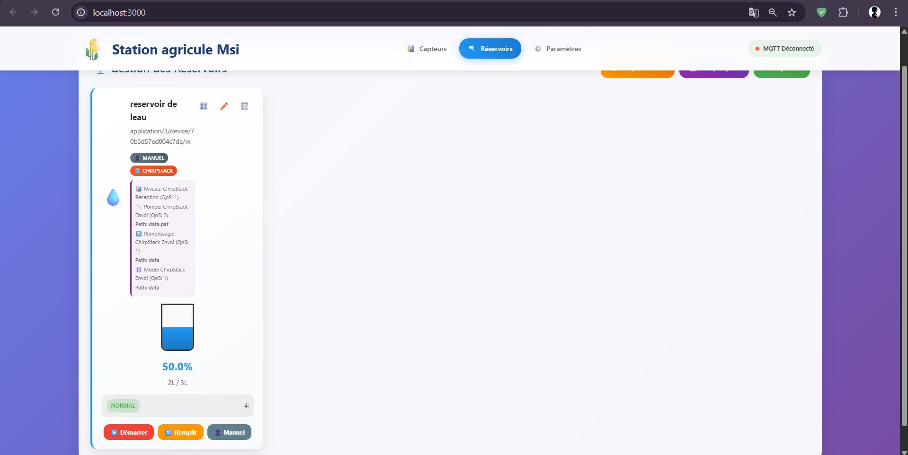

# 🌾 Station Agricole Pro – Real‑Time Agricultural IoT Platform (ChirpStack + MQTT + JSONPath)

A real‑time server and web dashboard to supervise an agricultural station:

- Dynamic sensor management (simple numeric or advanced JSON with JSONPath)
- Full ChirpStack integration (uplink parsing & downlink command format)
- Reservoir management (level, pump, fill, auto/manual mode)
- Thresholds, alerts, history & charts
- WebSocket (Socket.IO) live updates
- Flexible MQTT with per-topic QoS
- Lightweight persistence to JSON file (can be upgraded later)

---

## 🖼️ Visual Overview (Examples)

> Replace / adjust captions to match your real hardware.  
> You can move images into `docs/images/` later if you reorganize.

  
  
  

---

## 📌 Global Technical Overview

| Area | Description |
|------|-------------|
| Backend | Node.js (Express) + Socket.IO + MQTT client |
| Frontend | Single HTML file + rich CSS + dynamic JS |
| Protocols | Plain MQTT + ChirpStack specific JSON |
| JSON Extraction | Custom lightweight JSONPath subset (`object.temp`, `array[0].value`) |
| Persistence | Local JSON file (`./data/station_data.json`) |
| Real‑Time | Socket.IO events (push model) |
| History | In‑memory + saved periodically (max ~1000 points per entity) |
| Extensibility | Easy to add device types, new topics, analytics |

### Technical Strengths

1. Multi‑format payload support (raw numeric, generic JSON, ChirpStack receive/send).
2. Custom JSONPath interpreter without external dependency.
3. Independent QoS control per sensor and reservoir topic.
4. Auto format detection possible (when configured).
5. History downsampling when querying many points.
6. Modular separation for sensors vs reservoirs logic.

### Potential Improvements

| Domain | Suggestion |
|--------|------------|
| Security | Add API key / JWT auth, restrict CORS & WebSocket origins |
| Configuration | `.env` file for broker, port, etc. |
| Reliability | Queue unsent actions if broker offline |
| Storage | Replace JSON with SQLite / PostgreSQL / TimescaleDB |
| JSONPath | Swap with `jsonpath-plus` for richer expressions |
| Alerts | External notifications (Telegram, Email, Webhooks) |
| UI | Dark mode, multi-language (i18n), accessibility (ARIA) |
| MQTT Security | TLS + username/password |
| Rules Engine | Declarative conditions (ex: “if temp > X then alert”) |
| Scaling | Microservice split (ingestion, storage, API, UI) |

---

## 🧱 Architecture Diagram (Conceptual)

```
┌─────────────────────────────────────────────┐
│               Frontend (SPA)               │
│  - index.html                              │
│  - Socket.IO client                        │
│  - Chart.js charts                         │
└──────────────▲─────────────────────────────┘
               │ WebSocket (real-time events)
               │ REST (initial state/history)
┌──────────────┴─────────────────────────────┐
│              Backend (Node.js)             │
│  server.js:                                │
│   - Express API (sensors/reservoirs)       │
│   - MQTT client (ChirpStack + normal)      │
│   - JSONPath extraction logic              │
│   - In-memory + JSON persistence           │
│   - Threshold + alert emission             │
└──────────────▲─────────────────────────────┘
               │ MQTT (QoS n)
               ▼
        ┌───────────────────┐
        │   MQTT Broker      │
        │  (e.g. Mosquitto)  │
        └───────────────────┘
               │
        ┌──────────────┐
        │  ChirpStack   │
        └──────────────┘
               │
        ┌──────────────┐
        │  Devices /    │
        │  Sensors      │
        └──────────────┘
```

---

## ⚙️ Installation & Startup

### 1. Requirements
- Node.js ≥ 16
- A running MQTT broker
- (Optional) ChirpStack network server

### 2. Clone
```bash
git clone https://github.com/Armoumad/Station-Agricole-Pro.git
cd Station-Agricole-Pro
```

### 3. Install dependencies
```bash
npm install
```

### 4. Run
```bash
npm start
# or with auto reload:
npm run dev
```

### 5. Open UI
```
http://localhost:3000
```

---

## 🔧 Configuration (Current)

Inside `server.js`:
```js
const CONFIG = {
  PORT: 3000,
  MQTT_BROKER: 'mqtt://192.168.230.1:1883',
  DATA_FILE: './data/station_data.json'
};
```

Recommended (future): introduce `.env`:
```
PORT=3000
MQTT_BROKER=mqtt://192.168.230.1:1883
```
Then:
```js
const CONFIG = {
  PORT: process.env.PORT || 3000,
  MQTT_BROKER: process.env.MQTT_BROKER || 'mqtt://localhost:1883',
  DATA_FILE: './data/station_data.json'
};
```

---

## 🗂️ Project Structure

```
.
├── server.js
├── package.json
├── public/
│   └── index.html
├── data/
│   └── station_data.json   (generated)
├── 1752365116630.jpeg
├── 1752365116780.jpeg
├── 1752365117179.jpeg
└── README.md
```

---

## 🌐 REST API

| Method | Endpoint | Description |
|--------|----------|-------------|
| GET | `/api/data` | Complete station snapshot |
| POST | `/api/data` | Bulk update station structure |
| POST | `/api/sensors` | Add sensor |
| PUT | `/api/sensors/:id` | Update sensor |
| DELETE | `/api/sensors/:id` | Delete sensor |
| GET | `/api/sensors/:id/history?period=1h&points=50` | Sensor history |
| GET | `/api/charts/sensors/compare?ids=id1,id2&period=6h` | Multi-sensor comparison |
| POST | `/api/reservoirs` | Add reservoir |
| PUT | `/api/reservoirs/:id` | Update reservoir |
| DELETE | `/api/reservoirs/:id` | Delete reservoir |
| GET | `/api/reservoirs/:id/history?period=24h` | Reservoir history |
| POST | `/api/reservoirs/:id/pump` | Pump control (`{ "action": "start"|"stop" }`) |
| POST | `/api/reservoirs/:id/fill` | Trigger fill (command or simulation) |
| POST | `/api/reservoirs/:id/mode` | Switch mode (`{ "mode": "auto"|"manual" }`) |

### Add Sensor (ChirpStack Receive JSON)
```json
POST /api/sensors
{
  "name": "Greenhouse Temp 1",
  "type": "temperature",
  "unit": "°C",
  "topic": "application/1/device/abcd1234/event/up",
  "color": "#ff5722",
  "isJsonPayload": true,
  "jsonPath": "object.temperature_c",
  "jsonFormat": "chirpstack_receive",
  "mqttQos": 1,
  "showReceivedTimestamp": true,
  "minValue": 5,
  "maxValue": 38
}
```

### Add Reservoir (Multi-topic configuration)
```json
POST /api/reservoirs
{
  "name": "North Tank",
  "capacity": 2000,
  "topic": "application/1/device/abcd1234/event/up",
  "isJsonPayloadLevel": true,
  "jsonPathLevel": "object.level_percent",
  "jsonFormatLevel": "chirpstack_receive",
  "pumpTopic": "application/1/device/abcd1234/command/down",
  "isJsonPayloadPump": true,
  "jsonFormatPump": "chirpstack_send",
  "fillTopic": "application/1/device/abcd1234/command/down",
  "modeTopic": "application/1/device/abcd1234/command/down",
  "lowThreshold": 25,
  "mqttQosLevel": 1
}
```

---

## 🔄 WebSocket Events (Socket.IO)

| Event | Direction | Payload |
|-------|-----------|---------|
| `initial_data` | Server → Client | Full station object |
| `sensor_realtime_update` | Server → Client | `{ id, value, status, timestamp, receivedTimestamp? }` |
| `reservoir_realtime_update` | Server → Client | `{ id, level, timestamp }` |
| `reservoir_pump_changed` | Server → Client | `{ id, pumpStatus }` |
| `reservoir_mode_changed` | Server → Client | `{ id, isAutoMode, mode }` |
| `alert` | Server → Client | `{ type, sensor?, reservoir?, value?, level?, threshold }` |
| `reservoir_command` | Client → Server | `{ reservoirId, command }` (`pump_toggle` / `mode_toggle`) |

---

## 🧪 JSONPath (Internal Subset)

Supported patterns:
- `object.temperature_c`
- `data.sensors[0].temp`
- `payload.value`
- `sensors[2].reading`

Validation regex:
```
^[a-zA-Z_][a-zA-Z0-9_]*(\.[a-zA-Z_][a-zA-Z0-9_]*|\[\d+\])*$ 
```

---

## 🛎️ Alerts

Current types:
- `low_threshold` / `high_threshold` (sensor min/max breach)
- `low_level` (reservoir below threshold)

Suggested future:
- Staleness (no update > X minutes)
- Battery low (if added)
- Combined rule (ex: temperature high + soil moisture low)

---

## 🛡️ Security (Planned Enhancements)

| Aspect | Recommendation |
|--------|---------------|
| API Auth | Simple API key → JWT |
| Socket Auth | Token handshake |
| MQTT | TLS, credentials |
| Input Validation | Sanitize `topic`, `jsonPath`, clamp min/max |
| Rate Limiting | Prevent brute force or flooding |
| Logging | Structured logs + rotation |

---

## 📈 Performance & Limits

| Component | Strategy |
|-----------|----------|
| History size | Max 1000 entries per sensor/reservoir |
| Save cycle | Every change + periodic (30s) |
| MQTT reconnect | Automatic (5s backoff) |
| Downsampling | Step-based when too many points |
| Memory footprint | Suitable prototype scale (hundreds of metrics) |

---


---

## ✅ Summary

This platform provides a solid base for modern agricultural supervision: unified MQTT/LoRa/ChirpStack ingestion, flexible JSON extraction, actuator control (pump, mode), alerts, and real‑time visualization. Next steps: security, richer persistence, analytics, and notification intelligence.

Happy building! 🌱

---
_Open an Issue for any enhancement proposals._
